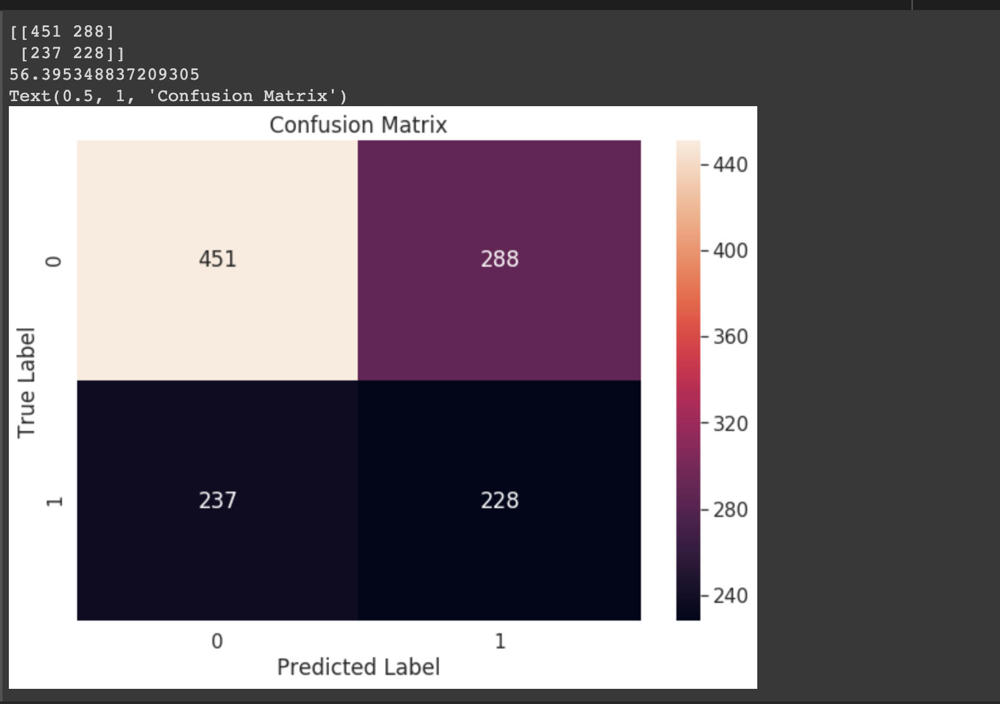
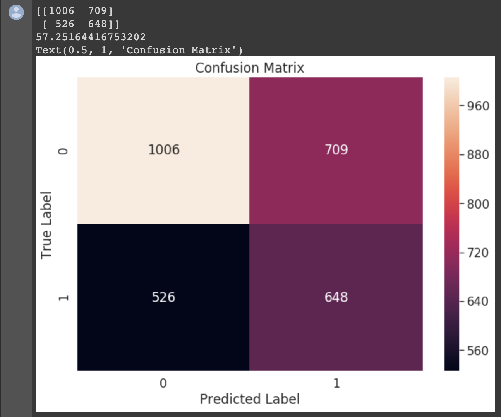

# histopathologic-cancer-detection
## presentaion link 
https://docs.google.com/presentation/d/1CB6JNgj_orP7W86tkedndcMT5lWXThPuhxrQEFyhBuk/edit?usp=sharing


## Code Files :
### For Final Sumissions please check 
  
  - Fisher Algorithm  >> "apply_fisher_algorithm_final_submission.ipynb"
  ##### Note . We Update the inverse function 
  from 
  ```
  def get_W(Sw, mean1, mean2):
    m= 10^-6
    return np.dot(np.linalg.inv(Sw+np.eye(Sw.shape[1])*m), (mean2-mean1))
    
  ```
   To 
  ```
  # weight equation
  def get_W(Sw, mean1, mean2):
  Sw_inv=np.linalg.pinv(Sw)
  return np.dot(Sw_inv,(mean2-mean1))
  
  ```
And run again for 6000 and 15000 samples   

| 6000                  | 15000                  |
|-----------------------|------------------------|
|  | |
  
  
 
